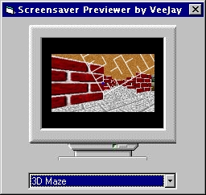



## Screensaver Previewer

### Description

This code is my first submission to PSC (I am sure you've read that a few thousand times), and is an update of John Zimmerman's Show Screensaver in VB. My code will list all screensavers in the Windows Directory and System Directory, and allow you to preview the screensavers, without a system crash. Also, a few useful functions are included, mostly for newbies, like Selection Sort, GetFileName (with or without extension), Append a filename to a path (taking into consideration the backslash. I don't expect you to vote for this, but is you want to, I won't stop you :)

Happy programming, VeeJay
 
### More Info
 
Without the TerminateProcess, your computer might (99% chance) crash and you will have to reboot

             |
---                |---
**Submitted On**   |2000-11-06 02:16:34
**By**             |[VeeJay](https://github.com/Planet-Source-Code/PSCIndex/blob/master/ByAuthor/veejay.md)
**Level**          |Beginner
**User Rating**    |4.0 (8 globes from 2 users)
**Compatibility**  |VB 5\.0, VB 6\.0
**Category**       |[Windows API Call/ Explanation](https://github.com/Planet-Source-Code/PSCIndex/blob/master/ByCategory/windows-api-call-explanation__1-39.md)
**World**          |[Visual Basic](https://github.com/Planet-Source-Code/PSCIndex/blob/master/ByWorld/visual-basic.md)
**Archive File**   |[CODE\_UPLOAD113341152000\.zip](https://github.com/Planet-Source-Code/veejay-screensaver-previewer__1-12557/archive/master.zip)

